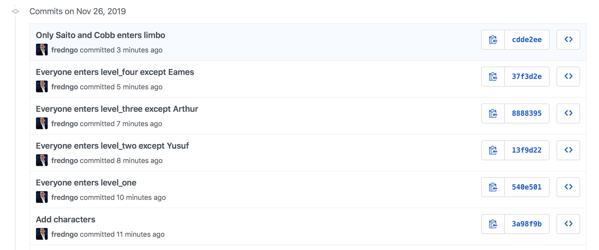

# Assignment: Inception

In this assignment, you'll practice:

* Creating folders/directories on the command line
* Creating files on the command line
* Deleting, renaming, and moving directories or files
* Finding what files your current directory contains, with `ls`
* Finding what your current working directory is, with `pwd`
* Using a Github Template
* Cloning a remote repo to your computer
* Adding and committing files and directories within a repo
* Pushing changes to Github
* Submitting homework assignments

---

# Exercise 1: Inception

This assignment will give you some practice with Git, Github, and the command line, by recreating the story of [Inception](http://www.imdb.com/title/tt1375666/?ref_=fn_al_tt_1).

You should also get a sense of what Git is, how it differs from GitHub, and how to use each of these tools.


* We'll learn how to clone a remote repo to your local computer, and pushing changes from your local repo back to the remote repo
* Locally, we'll use Git commands to work with files

Instead of dreams and characters, we will be using directories and files.

Each directory will represent a level and each file will represent a character.

As you go down each level (directory), one character (file) will be left behind and you will make a commit.

The 7 characters from the movie are:

* `saito`
* `ariadne`
* `cobb`
* `fischer`
* `eames`
* `arthur`
* `yusuf`

[Here's an infographic depicting the different dream levels and who goes where](assets/inception_infographic.jpg)

## Setting Up

1. Go to the assignment's page on Github

1. Click the **Use this template** button in the repo, and follow the prompts
   * In the **Owner** dropdown, be sure to select _your_ username, not PYTHR-xxx-yyyy (you don't have any control over the course account)
   * You can use the same assignment name
   * If you forget to do this to make a copy of the assignment repo, you won't be able to complete the assignment successfully, since you don't have permission to modify the original files!

1. Open your Terminal. Check that you're in your development work folder:

   ```zsh
   pwd
   ```

   should result in something like `/Users/jane/documents/dev` (depending on what OS you are using)

1. **Clone** _your_ copy of the assignment repo onto your computer using the command line
   * Click the green **Code** button in the repo
   * Copy the URL
   * Use the URL with the `git clone` command, like so:

   **Protip:** :exclamation: Replace `YOUR_USERNAME` with your actual Github user name :exclamation: 

   ```zsh
   git clone https://git.generalassemb.ly/YOUR_USERNAME/hw-07-inception.git
   ```

   * Remember to clone _your_ repo, not the instructor's, so that you can make changes to it!

1. Navigate inside the folder of the newly cloned assignment repo:

   ```zsh
   cd hw-07-inception
   ```

Continue with the assignment steps below. Have fun and feel free to discuss on our Slack discussion channel!

## Assignment Steps

1. Create text files, one for each character listed above
   * As an example, `ariadne.txt` was already created for you
   * Go ahead and create `arthur.txt`, `cobb.txt`, etc.
1. **Add** your files, and **Commit** to record this chapter of the story
1. Now, all the characters will start dreaming. Create the first directory called `level_one` and move all your characters into it
1. **Add** your changes and make another **commit**!
1. Create the next directory, `level_two`
   * Don't forget that `level_two` needs to be *inside* `level_one`!
   * All of the characters, except for one, will dream into the second level. So move all but one character down into `level_two`.
   * **add** and **commit** again!
1. Keep going for 2 more levels (`level_three` and `level_four`). Do the same thing at each level by moving all but one character down, adding and committing each step of the way
   * **You must add your changes and commit after each level, otherwise you won't be taking snapshots in time!**
1. The final level is `limbo`. According to the movie only Saito and Cobb go into `limbo`, but you can move whoever you like here... The point is just to get some command-line practice!
1. When you are all finished, push your commits to GitHub

## Solution

Specially only for this assignment -- the "[solution](https://git.generalassemb.ly/PYTHR-Library-fredngo/hw-01-inception-solution)" is already available for you to look at.

When you are done, your repo inside your GitHub account should look similar to the solution.

Take note of the commit history!



## Submitting

To submit this assignment:

1. In your web browser, go to the **assignment's main repo** (not your fork)
1. Click the **Issues** tab
1. Click the **New Issue** button
1. In the Title field, fill in your name
1. In the comment field, copy and paste the URL to *your* assignment repo
1. Click **Submit new issue** and you're done!

---

# The Dream is Real


If you haven't watched Inception yet, maybe give it a shot, it's pretty good!

<!-- 
# Tips and Tricks

## Subdirectories

When you add your changes from within a subdirectory, you will need to use the `--all` flag instead of `git add .`:

```zsh
git add --all
```

## Empty Directories

Git only tracks files and not directories. You won't be able to commit a new directory unless there's at least one file in it! See [Git FAQ: Empty directories](https://git.wiki.kernel.org/index.php/GitFaq#Can_I_add_empty_directories.3F) for more details.

## Help on Command-Line Commands

If you want more information about a command-line command you can type:

```zsh
man <the name of the command>
```

To quit the help screen type `q`.

## Undoing a Commit

You might also want to go back to the previous commit. To do this type:

```zsh
git reset --hard HEAD^
```

If you want to know the differences between `--hard`, `--soft`, and `--mixed`, check [this StackOverflow question](http://stackoverflow.com/questions/3528245/whats-the-difference-between-git-reset-mixed-soft-and-hard) out.


## Important Git Commands Cheatsheet

### Local Repository Workflow

* Shows the current status of `git`

   ```zsh
   git status
   ```

* Add all file changes (including deleted files) to the next commit

   ```zsh
   git add --all
   ```

* Creates a new commit (a snapshot in time) with an associated message

   ```zsh
   git commit -m "<message>"
   ```
   
* Shows history of commits

   ```zsh
   git log
   ```

### Remote Repository Workflow

* Makes a copy of a remote repo (that lives on Github) to your computer

   ```zsh
   git clone <github repo url>
   ```

* Pushes changes from the local repo to the remote repo

   ```zsh
   git push
   ```

* Pulls changes from the remote repo to your local repo (we haven't covered this yet)

   ```zsh
   git pull
   ```
-->
